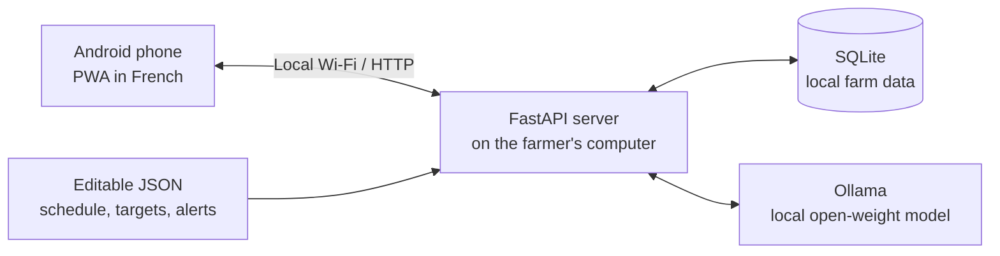

# KukuTrack

**A local-first broiler batch tracker that lets a farmer record poultry data in French, with optional open-weight AI running on the same computer.**

## Why this exists

KukuTrack was built for one real person: a small broiler farmer who needs a quick way to track a batch while working with an Android phone. Internet access can be unreliable and expensive, so the core application keeps the data on the farmer's own computer and does not depend on a cloud AI service.

## Features

- Create batches and generate editable reminder calendars from `config/default_schedule.json`.
- Record daily mortality, feed, notes, and weigh-ins from a phone.
- View birds alive, mortality, feed, weights against an editable target curve, and reminder status.
- Show configurable, rule-based alerts and a weekly summary with a deterministic fallback.
- Turn a French sentence into an editable proposal with a local Ollama model; nothing is saved until the farmer confirms it.
- Run as an installable mobile PWA with an app-shell cache, draft preservation, connection status, and SQLite backup download.
- Generate a clearly labelled fake 45-day demonstration batch.

## Why open-source AI matters here

The assistant uses an open-weight model through local [Ollama](https://ollama.com/). It can work without Internet access after the model is installed, keeps farm data on the farmer's computer, has no AI subscription requirement, and can be changed to another locally installed model by setting one environment variable.

## Architecture



The phone loads the PWA from the local FastAPI server. FastAPI reads and writes the local SQLite database and reads the editable JSON configuration files. Ollama is optional: manual entry still works when it is unavailable.

### From a sentence to saved data

```text
Farmer's sentence → local Ollama → structured proposal → editable confirmation → existing validation services → SQLite
```

The model only proposes fields. The farmer reviews and confirms them before the app calls the normal log or weigh-in services.

## Install and run

### Prerequisites

- Python 3.11 or newer
- [Ollama](https://ollama.com/download) installed locally if you want to use the assistant

Create and activate a virtual environment if desired, then install the project dependencies:

```bash
pip install -r requirements.txt
```

The local model currently used for development is `gemma3:4b`. Pull it and point KukuTrack to it:

```bash
ollama pull gemma3:4b
export OLLAMA_MODEL=gemma3:4b
```

Start Ollama in the usual way for your operating system, then start KukuTrack:

```bash
uvicorn app.main:app --reload --host 0.0.0.0 --port 8000
```

Open <http://127.0.0.1:8000> on the computer. The database defaults to `data/kukutrack.db`; set `KUKUTRACK_DB` to use another path. `OLLAMA_URL` and `OLLAMA_TIMEOUT_S` are also configurable environment variables.

### Open it on a phone

1. Connect the phone and computer to the same Wi-Fi network.
2. Find the computer's local IPv4 address, for example `192.168.1.25`.
3. On the phone, open `http://192.168.1.25:8000`.
4. In Chrome on Android, choose **Add to Home screen** to install the PWA.

The app shell is cached after the first successful visit, so it can still open briefly if the computer becomes unreachable. Live farm data always requires the local server; the UI shows a French connection warning instead of showing cached API data as current.

## Demo data

Create one deterministic, clearly fake batch named `DEMO (fake data)`:

```bash
python scripts/seed_demo.py
```

The command refuses to create a second demo batch. Recreate only that demo batch with:

```bash
python scripts/seed_demo.py --reset
```

Use another database file without touching the default database:

```bash
python scripts/seed_demo.py --db path/to/demo.db
```

## Development checks

```bash
pytest
ruff check .
```

To try the real local parser from the command line:

```bash
python scripts/try_parse.py "ce matin 2 morts et 4 kg d'aliment"
```

## Local voice input

KukuTrack can transcribe a short audio recording locally with `faster-whisper`. The default `small` Whisper model is a practical CPU trade-off for a laptop; set `WHISPER_MODEL` to use another compatible model and `WHISPER_LANGUAGE` to change the French language hint.

```bash
export WHISPER_MODEL=small
export WHISPER_LANGUAGE=fr
```

The first transcription downloads the selected model, so connect the computer to the Internet once during setup. Later transcriptions run locally and temporary audio files are deleted after processing.

Browsers allow live microphone APIs only over HTTPS or `localhost`. On a computer opened at `http://localhost:8000` (or with HTTPS), **Parler** asks for microphone permission and records directly. A phone reaching the computer over local HTTP cannot use the live microphone API, so **Parler** opens its native recorder instead; **Choisir un audio** remains available everywhere. The transcript only fills the editable text box and still requires the normal confirmation flow before data is saved.

## Safety and limits

- The AI never diagnoses diseases or gives veterinary treatment advice.
- The AI never writes to the database by itself; every proposed entry needs explicit confirmation.
- Reminder schedules, target weights, and alert thresholds are editable placeholders. Confirm them with the farmer and a veterinarian before relying on them. The default schedule intentionally contains no doses or brands.
- Small local models can misunderstand a sentence. Review every proposed number and date before confirming it.
- A real broiler batch lasts roughly 45 to 60 days. **TODO — field-test duration: add the actual number of days tested here.**

## Project status

KukuTrack was built during the **Hacktoberfest 2026 Weekend Challenge 1**. Changes made after that challenge deadline should be listed here:

- **TODO:** add dated post-deadline changes here.

## Screenshots to add

<!-- Add docs/screenshots/dashboard.png: open the DEMO batch and capture the dashboard with charts, alerts, and weekly summary. -->
<!-- Add docs/screenshots/assistant-confirmation.png: enter a French sentence and capture the editable confirmation card before saving. -->
<!-- Add docs/screenshots/mobile-home.png: capture the installed PWA home screen on an Android phone. -->

See [docs/screenshots/README.md](docs/screenshots/README.md) for the capture checklist.

## License

KukuTrack is available under the [MIT License](LICENSE).
